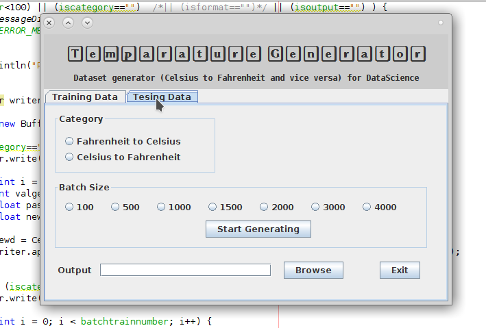

# Dataset Generator

------

#### <u>Info:</u>

This a dataset generator that generates data for use in data science.

The data is for use mainly in regression analysis. The data in both columns is a Fahrenheit column and a Celsius column.

>  The arrangement of the columns is dependent on the fields selected before pressing *Generate Data* button.

The two main Feature of this simple program i to generate  a sample training data and testing data. The validation data can be split from training data.

------

#### <u>Running the executable</u>

clone the repository by running the code

```bash
git clone https://github.com/Niccher/Data-Generator.git
```

```bash
cd Data-Generator/dist
```

> Note for the code to be executed , you need to first have *Java* installed

```bash
java -jar Data_Generator.jar
```

------

#### <u>Generating Training data</u>

A resulting window will appear where you will interact with the client


The selected tab *Training Data* generates data for use as the training data, has several features I have assigned to it such as ,

1. Category:
	This has the format of the output, that is the order of columns in the output datafile.
	
2. Output Format:
	The extension of the file and the delimiter between the columns per row. These delimiters can only  be either a *comma* or a *tab*.
	
3. Batch Size:

   This specifies the number of rows one wants to generate in the output file.

4. Output Location Indicator:

   The Browse button opens a file-chooser prompt that asks you where you want to save the data.

To generate a dataset ensure you select all the above feature then initiate the generator by pressing the *Start Generating* button.

 A confirmation window shall pop-up to indicate that it's  finished, Simply as that your training data has been generated and saved for you.

------

#### <u>Generating Testing data</u>

To generate testing data,  press the next tab and a new panel will appear



The selected tab *Testing Data* generates data for use as the testing data, it has  ,

1. Category:
   This has the format of the output, that is the order of columns in the output datafile.

2. Batch Size:

   This specifies the number of rows one wants to generate in the output file.

3. Output Location Indicator:

   The Browse button opens a file-chooser prompt that asks you where you want to save the data.

   ------

   #### <u>Algorithms Used</u>

1. Random Number Generator

   > The application uses a simple random generator that . The method implementing this is bounded by the length of number generated
   >
   > ```java
   > private int getRandomNumberInRange(int min, int max) {
   > 	Random r = new Random();
   >     return r.ints(min, (max + 1)).limit(1).findFirst().getAsInt();
   >  }
   > ```
   >
   > This method is invoked till the all iterations are completed. The iterations are specified by the batch number you specified  earlier, as shown below.
   >
   > 

   

2. Converters

   > The temperature converter [*Fahrenheit to Celsius and vice versa*] is enabled by using this two methods.
   >
   > - Fahrenheit to Celsius
   >
   >   ```java
   >   private float FahtoCelsius(float parsed){
   >       //T(°C) = (T(°F) - 32) / (1.8)
   >       float cel=(float) ((parsed - 32) / (1.8));
   >       return cel;
   >      }
   >   ```
   >
   > - Celsius to Fahrenheit
   >
   >   ```java
   >   private float CelsiustoFah(float parsed){
   >       //F = C * 1.8 + 32  
   >       float fah=(float) ((parsed * 1.8) + 32);
   >       return fah;
   >   }
   >   ```

   